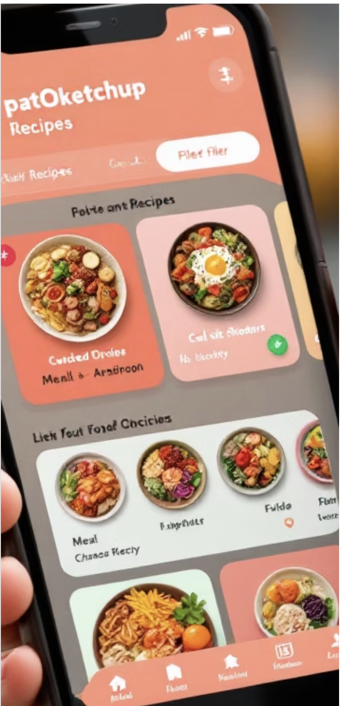
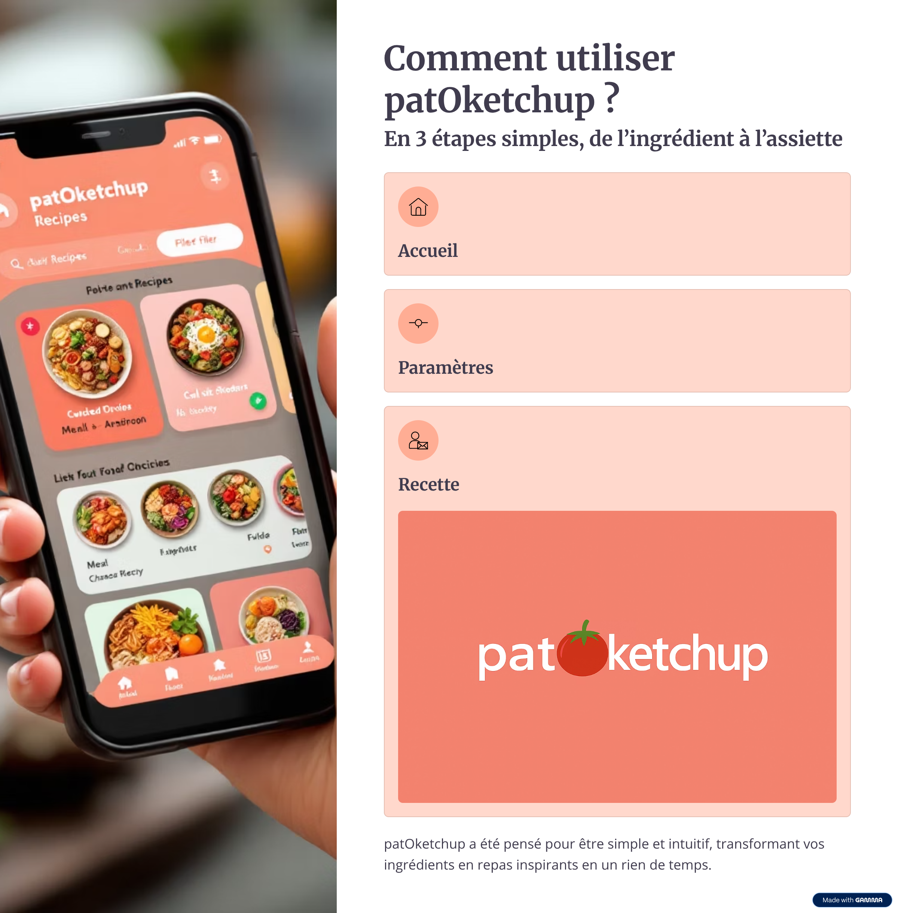

# 🥙 PatOketchup - Application de Recettes Anti-Gaspi

[](https://opensource.org/licenses/MIT)
[](https://developer.mozilla.org/en-US/docs/Web/HTML)
[](https://developer.mozilla.org/en-US/docs/Web/CSS)
[](https://developer.mozilla.org/en-US/docs/Web/JavaScript)

## 🌟 Présentation

PatOketchup est une application web moderne de découverte de recettes avec une approche **anti-gaspillage alimentaire**. L'application permet aux utilisateurs de trouver des recettes en fonction des ingrédients qu'ils ont chez eux, encourageant ainsi une cuisine créative et responsable.



## ✨ Fonctionnalités Principales

### 🏠 Page d'Accueil
- **6 recettes de présentation** : Sélection soignée de recettes locales et populaires
- **Interface moderne** : Design épuré avec animations fluides
- **Navigation intuitive** : Accès rapide à toutes les sections

### 🧊 "Mon Frigo" - Système Intelligent Anti-Gaspi
- **Ajout d'ingrédients** : Interface avec tags visuels
- **Suggestions automatiques** : L'application propose des ingrédients pendant la saisie
- **Recherche multi-ingrédients** : Trouve des recettes en fonction de vos ingrédients
- **Traduction français ↔ anglais** : Compatibilité avec l'API TheMealDB
- **Scoring intelligent** : Priorise les recettes qui utilisent le plus d'ingrédients disponibles

### 🎯 Indicateurs Anti-Gaspi
- **Badges de réduction de gaspillage** :
  - 🏆 **80%+** : Utilise presque tous vos ingrédients
  - 🟢 **50-79%** : Bon taux d'utilisation
  - 🟡 **<50%** : Utilisation basique
- **Correspondance d'ingrédients** : Affiche combien d'ingrédients correspondent
- **Indicateur de complexité** : ⚡ Rapide, 🕒 Moyen, 👨‍🍳 Complexe

### 🔍 Système de Recherche Avancé
- **API TheMealDB** : Base de données gratuite de recettes
- **Filtrage intelligent** : Tri par correspondance d'ingrédients
- **Correspondance partielle** : Trouve des recettes même avec synonymes
- **Affichage détaillé** : Images, temps de préparation, instructions

## 🛠️ Technologies Utilisées

### Frontend
- **HTML5** : Structure sémantique moderne
- **CSS3** : Animations, grid layout, variables CSS
- **JavaScript ES6+** : Programmation moderne avec async/await

### API & Services
- **TheMealDB API** : Base de données gratuite de recettes
- **Traduction automatique** : Dictionnaire français→anglais intégré
- **Images Unsplash** : Images de fallback pour les recettes

### Architecture
- **Single Page Application (SPA)** : Navigation fluide sans rechargement
- **Responsive Design** : Compatible mobile, tablette, desktop
- **Progressive Enhancement** : Fonctionne même sans JavaScript

## 🚀 Installation & Utilisation

### Prérequis
- Navigateur web moderne (Chrome, Firefox, Safari, Edge)
- Connexion internet pour l'API

### Installation
```bash
# Cloner le repository
git clone https://github.com/Mehdichoucha/btp-projet-ia.git
cd btp-projet-ia/patoketchup

# Ouvrir dans votre navigateur
open index.html
```

### Utilisation
1. **Page d'accueil** : Explorez les 6 recettes de présentation
2. **"Mon Frigo"** : Ajoutez vos ingrédients avec des tags visuels
3. **Recherche** : L'application trouve automatiquement des recettes compatibles
4. **Sélection** : Choisissez selon les indicateurs anti-gaspi
5. **Préparation** : Suivez les instructions détaillées

## 🔧 Guide Technique

### Structure des Fichiers
```
patoketchup/
├── index.html          # Page principale
├── style.css           # Styles et animations
├── script.js           # Logique JavaScript
├── Images/             # Assets visuels
│   ├── logo.png
│   ├── interface.png
│   └── Comment-utiliser-patOketchup.png
└── README.md           # Documentation
```

### API Configuration
```javascript
const API_CONFIG = {
    baseURL: 'https://www.themealdb.com/api/json/v1/1',
    endpoints: {
        searchByName: '/search.php?s=',
        searchByIngredient: '/filter.php?i=',
        getById: '/lookup.php?i=',
        categories: '/categories.php'
    }
};
```

### Traduction d'Ingrédients
L'application inclut un dictionnaire de traduction pour convertir les ingrédients français vers l'anglais :
```javascript
const INGREDIENT_TRANSLATION = {
    'tomate': 'tomato',
    'oignon': 'onion',
    'poulet': 'chicken',
    // ... 50+ ingrédients
};
```

## 🎨 Fonctionnalités Avancées

### Système de Tags Visuels
- **Ajout dynamique** : Cliquer pour ajouter un ingrédient
- **Suppression** : Bouton × sur chaque tag
- **Auto-complétion** : Suggestions pendant la saisie
- **Animation** : Transitions fluides

### Algorithme Anti-Gaspi
```javascript
function calculateIngredientMatch(userIngredients, recipeIngredients) {
    // Correspondance exacte + synonymes
    // Score de gaspillage = (ingrédients utilisés / ingrédients disponibles) * 100
    // Tri intelligent par priorité
}
```

### Interface Adaptative
- **Responsive Grid** : S'adapte à toutes les tailles d'écran
- **Loading States** : Indicateurs de chargement
- **Error Handling** : Gestion élégante des erreurs

## 📱 Captures d'Écran

### Interface Principale


### Guide d'Utilisation


## 🤝 Contribution

### Comment Contribuer
1. Fork le projet
2. Créer une branche feature (`git checkout -b feature/AmazingFeature`)
3. Commit vos changements (`git commit -m 'Add some AmazingFeature'`)
4. Push vers la branche (`git push origin feature/AmazingFeature`)
5. Ouvrir une Pull Request

### Améliorations Possibles
- [ ] Mode sombre/clair
- [ ] Sauvegarde des favoris
- [ ] Liste de courses automatique
- [ ] Planification de repas
- [ ] Partage de recettes
- [ ] Mode hors ligne

## 📄 License

Distribué sous la License MIT. Voir `LICENSE` pour plus d'informations.

## 👥 Équipe

- **Développement Frontend** : Interface moderne et responsive
- **Intégration API** : TheMealDB et traduction automatique
- **UX/UI Design** : Design centré utilisateur anti-gaspi
- **Optimisation** : Performance et accessibilité

## 📞 Contact & Support

- **Email** : [votre-email]
- **GitHub** : [votre-profil-github]
- **LinkedIn** : [votre-profil-linkedin]

---

## 🌍 Impact Environnemental

PatOketchup contribue à la **réduction du gaspillage alimentaire** en :
- Encourageant l'utilisation d'ingrédients disponibles
- Proposant des recettes adaptées aux stocks
- Sensibilisant aux bonnes pratiques culinaires
- Facilitant la cuisine créative et responsable

---

*Développé avec ❤️ pour une cuisine plus responsable*